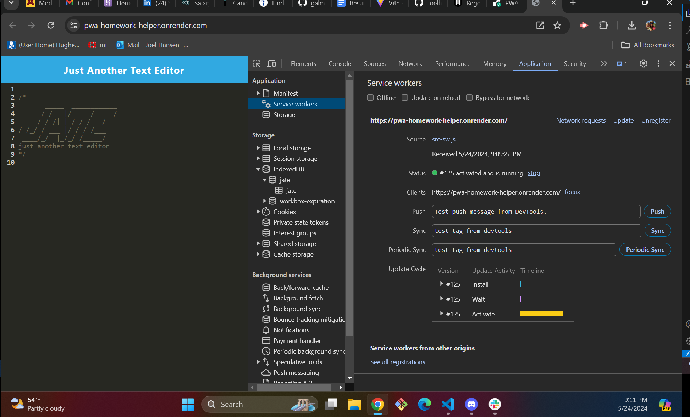
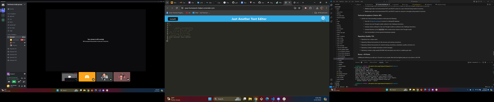
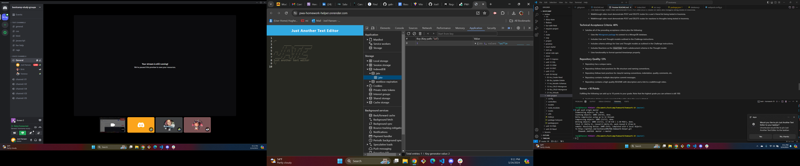
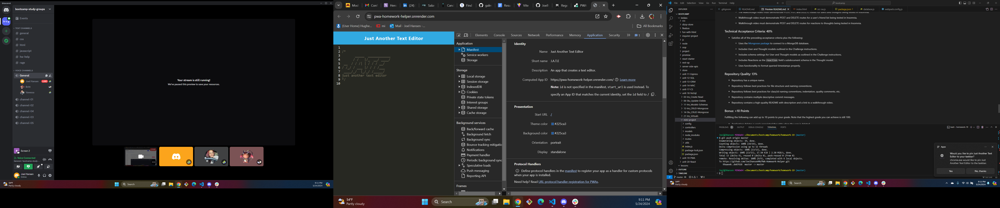

# PWA: Homework Helper Text Editor

## Description
  For this task we were instructed to build a single page text-editor application and it should be up to PWA functionality.    

## Screenshots
 

##  Questions
  joelhansen22@gmail.com
  
  [Github](https://www.github.com/joelhansenmn)

  ## Links:
  [link to repo](https://github.com/JoelhansenMN/PWA-Homework-Helper)

  [link to application on render](https://pwa-homework-helper.onrender.com/)
